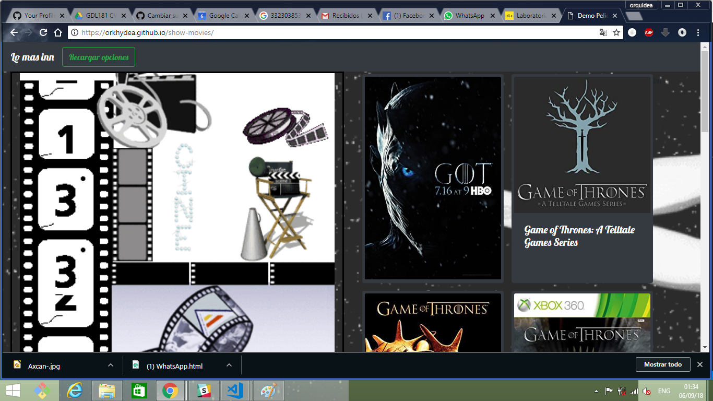

# Presentacion de peliculas

Consume el API de OMDB (The Open Movie Database) y crea una interfaz web que presente la información de cada película como lo refleja el siguiente GIF (incluyendo animaciones):

## Requisitos:
Los estilos deben darse según el GIF, pero pueden usar su creatividad. 
Debe ser responsive.
La aplicación debe soportar la última versión de Firefox y Chrome, y las experiencias de ambos deben ser consistentes.
Usar las herramientas que necesite, incluyendo los frameworks de JS como CSS que consideres. 

